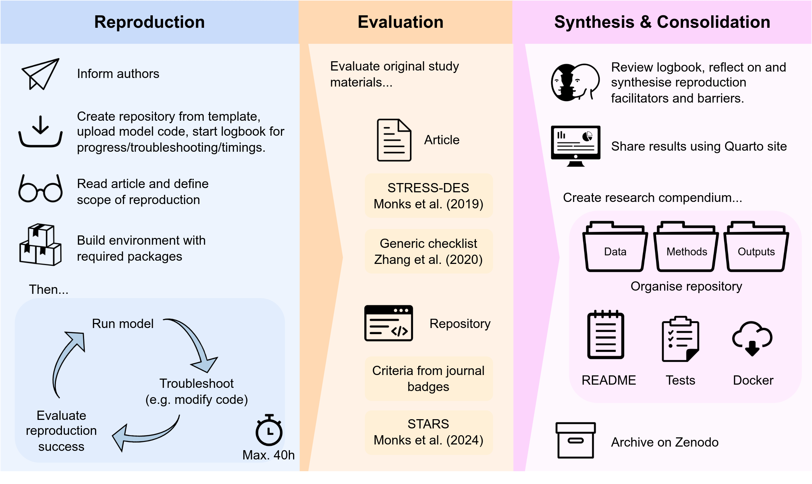
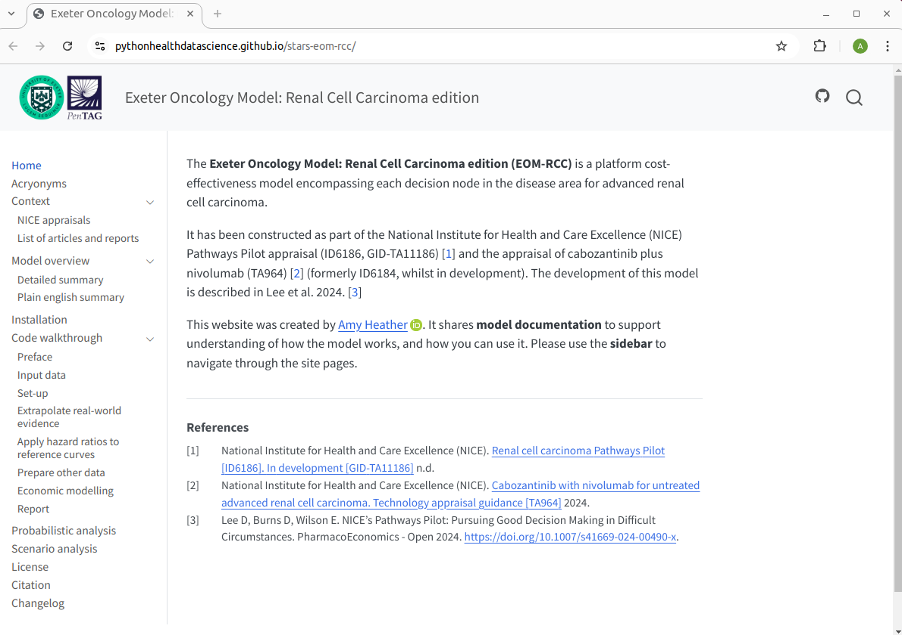
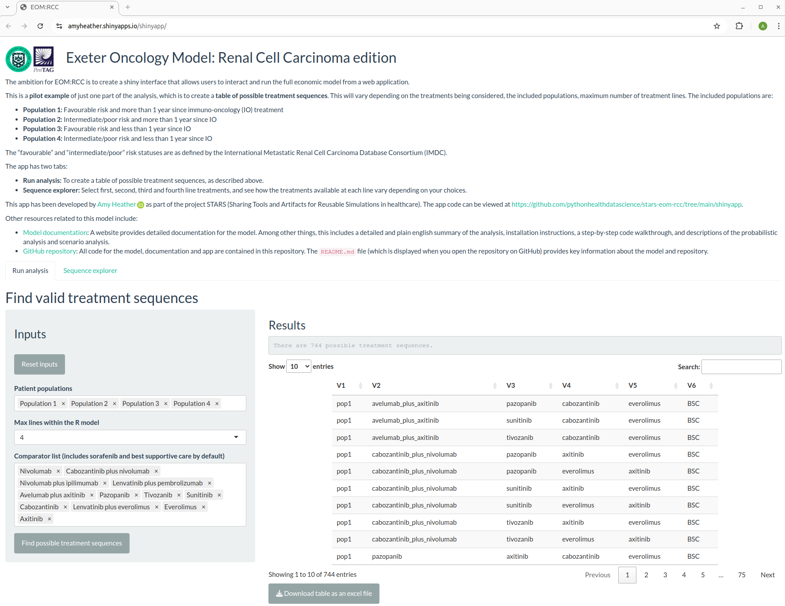
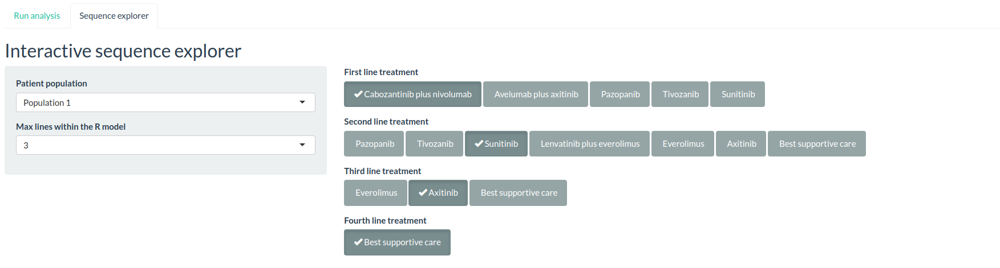
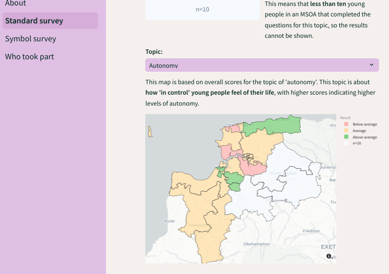
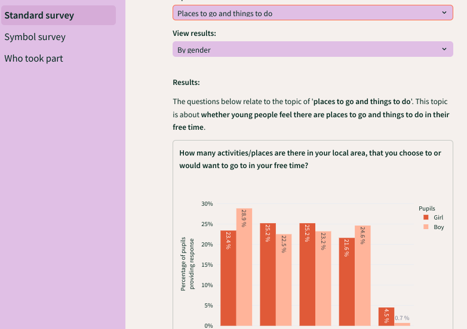
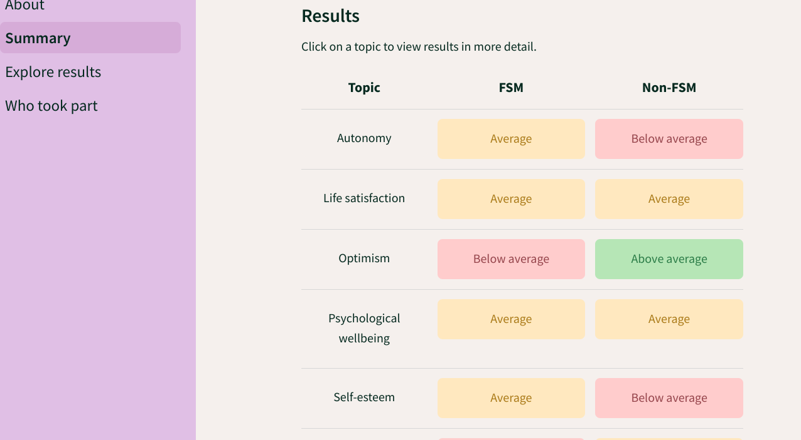
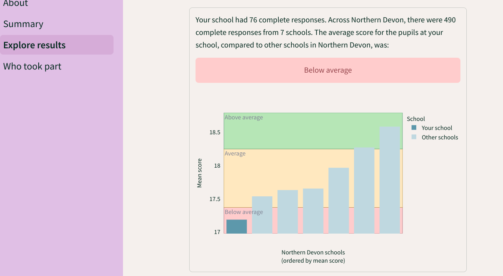

<h1 align="center">Amy Heather</h1>

  <a>I am currently a **Postdoctoral Research Associate** at the **University of Exeter**. I'm based in the Peninsula Collaboration for Health Operational Research and Data Science ([PenCHORD](https://penchord.github.io/web/intro.html)).</a>
   
   
  <a href="orcid"></a>
  <a href="linkedin"></a>
  <a href="dimensions"></a>
  <a href="scopus"></a>
  <a href="email"></a>
  <a href="exeter_profile"></a>

  

---

### :hammer_and_wrench: Languages and Tools :

  &nbsp;
  &nbsp;
  &nbsp;
  &nbsp;
  &nbsp;
  &nbsp;

---

### 🌱 I’m currently working on ...

**STARS** - Sharing Tools and Artefacts for Reusable Simulations in Healthcare - [GitHub organisation](https://github.com/pythonhealthdatascience)

I am working on the STARS project from **May 2024 to April 2026**. Highlights so far:

* [Computational reproducibility assessments](https://pythonhealthdatascience.github.io/stars_wp1_summary/) of eight published discrete-event simulation studies in health. For each study, I attempted reproduce any results tables, figures and in-text results. I also evaluated the repository and article against various guidelines and criteria. For each assessment, the results are shared as a quarto site, with the repository structured as a "researched compendium", and test-run by a second team member.

  

* [Modifications to the "Exeter Oncology Model: Renal Cell Carcinoma edition (EOM-RCC)"](https://github.com/pythonhealthdatascience/stars-eom-rcc). This is a model associated with technology appraisals from the National Institute of Health and Care Excellence (NICE), which was developed by the Peninsula Technology Assessment Group (PenTAG). I worked on this model to improve its open science credentials, developing a [clear README](https://github.com/pythonhealthdatascience/stars-eom-rcc), [website hosting detailed documentation](https://pythonhealthdatascience.github.io/stars-eom-rcc/), and a [pilot web application for exploring treatment sequences](https://amyheather.shinyapps.io/shinyapp/).

  
  

   

---

### 🔭 I’ve previously worked on ...

<b>Kailo - Delivery #BeeWell (a school-based wellbeing survey) with schools in Northern Devon</b>

 

I worked on Kailo from **October 2022 to April 2024**. My role was related to set-up and delivery of the #BeeWell survey, and the creation of dashboards to share results with schools and other stakeholders. #BeeWell was a school-based wellbeing survey being completed by secondary school pupils in Northern Devon in the academic year 2023-24. There were two versions of the survey - a standard survey being delivered at seven mainstream schools, and a symbol version being delivered at two non-mainstream schools. [This video](https://youtu.be/vt5fpE0bzSY) below provides a helpful introduction to the survey. It was designed to introduce young people to the survey. You can find out more about the survey at <https://kailo.community/beewell/>.

We planned to share results from the survey will be shared using dashboards (with dashboards for school-level and area-level dashboards). These are publically available with synthetic data. These have been produced using Streamlit.

* GitHub repository: [https://github.com/kailo-beewell](https://github.com/kailo-beewell)
* Package used to produce dashboards: [kailo-beewell-dashboard](https://github.com/kailo-beewell/kailo_beewell_dashboard_package).
* Streamlit dashboards:
    * Standard survey school dashboard - 
    * Symbol survey school dashboard - 
    * Area-level dashboard - 

My time on this project ended during the survey collection window. At this point, several schools had begun successfully completing the survey, and I had developed three synthetic dashboards which were very nearly complete. Before leaving, I spent a few months explaining the survey and dashboards to two colleagues at Dartington Service Design Lab, who took over the survey delivery and analysis from the point when I left the project. As such, I am no longer responsible for maintenance of these dashboards.

Exemplar screenshots from dashboards:

  
   

  
   

<b>Birth outcomes - Pilot work on birth outcome prediction, using cardiotocography (CTG) data and causal inference methods</b>

  
[GitHub organisation](https://github.com/birth-outcomes)

<b>IPACS - Improving Patient flow between Acute, Community and Social care</b>

 

In **March and April 2023**, I contributed to the discrete-time model on IPACS.

I worked through the code for the model, rewriting and simplifying to improve clarity, adding comments and docstrings, and identifying and fixing bugs (as detailed [here](https://github.com/AliHarp/IPACS_MODEL)). This contributed to the [final repository hosted with NHS BNSSG Analytics](https://github.com/nhs-bnssg-analytics/ipacs-model).

I also created an example of converting part of the model (the visit-based simulation) into an R package, [as in this repository](https://github.com/amyheather/ipacs). This is supported by a [website](https://amyheather.github.io/ipacs/) that provides an overview of how to run the model, and information about the model functions.

<b>SAMueL2 - Stroke Audit Machine Learning</b>

  
* [Data cleaning and descriptive analysis of SNNAP data](https://github.com/samuel-book/samuel_2_data_prep)
* [Demographics of emergency stroke unit catchment areas](https://github.com/samuel-book/stroke_unit_demographics)

---

### 🌸 These are a few of my favourite things...

* [Quarto](https://quarto.org/)
* [Streamlit](https://streamlit.io/)
* [Image colour picker](https://imagecolorpicker.com/)
* [Draw.io](https://draw.io)
* [Inkscape](https://inkscape.org/)
