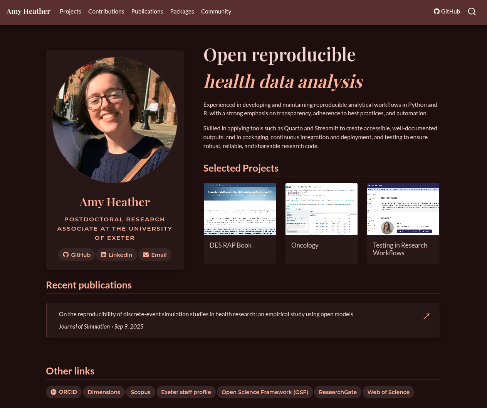

<h1 align="center">Amy Heather</h1>

  <a>I am currently a **Postdoctoral Research Associate** at the **University of Exeter**. I'm based in the Peninsula Collaboration for Health Operational Research and Data Science ([PenCHORD](https://penchord.github.io/web/intro.html)).</a>
   
   
  <a href="orcid"></a>
  <a href="linkedin"></a>
  <a href="dimensions"></a>
  <a href="scopus"></a>
  <a href="email"></a>
  <a href="exeter_profile"></a>
  <a href="osf">[-Amy_Heather-27b8ef)](https://osf.io/wmxtc/)</a>
  <a href="osf"></a>
  <a href="osf"></a>
  

  

---

### :hammer_and_wrench: Languages and Tools :

  &nbsp;
  &nbsp;
  &nbsp;
  &nbsp;
  &nbsp;
  &nbsp;
  &nbsp;

---

### 💼 What have I been working on?

Go to my personal website <http://amyheather.github.io/> to find out!

