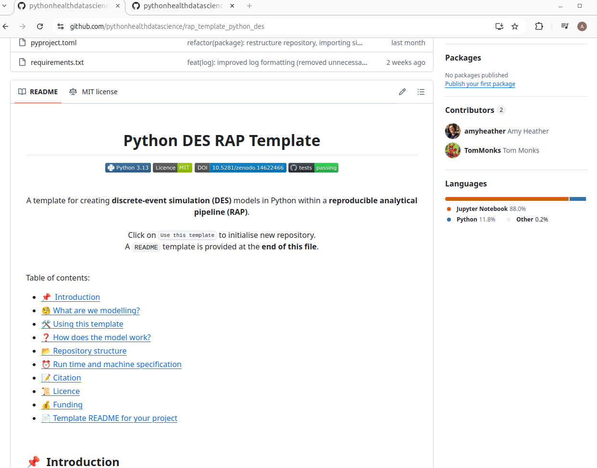
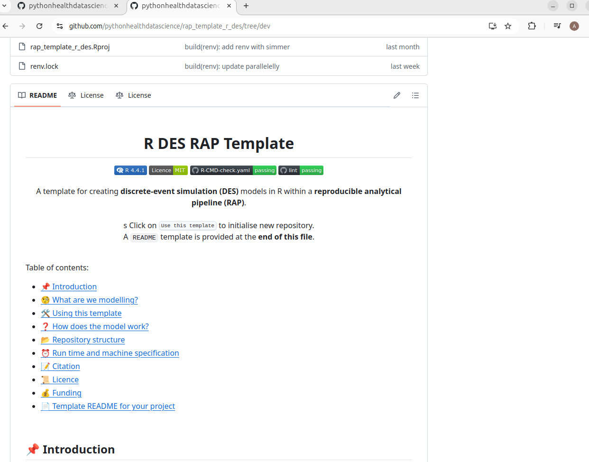
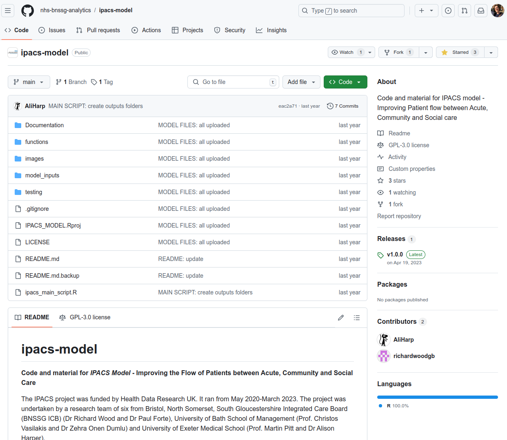
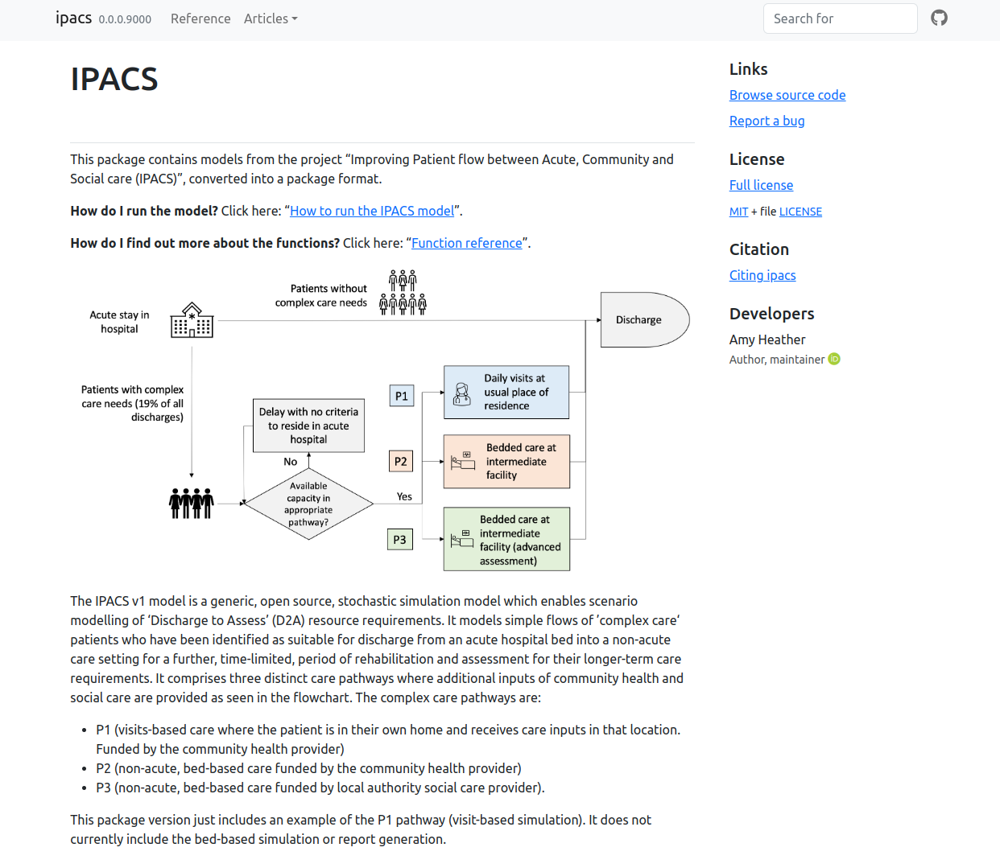
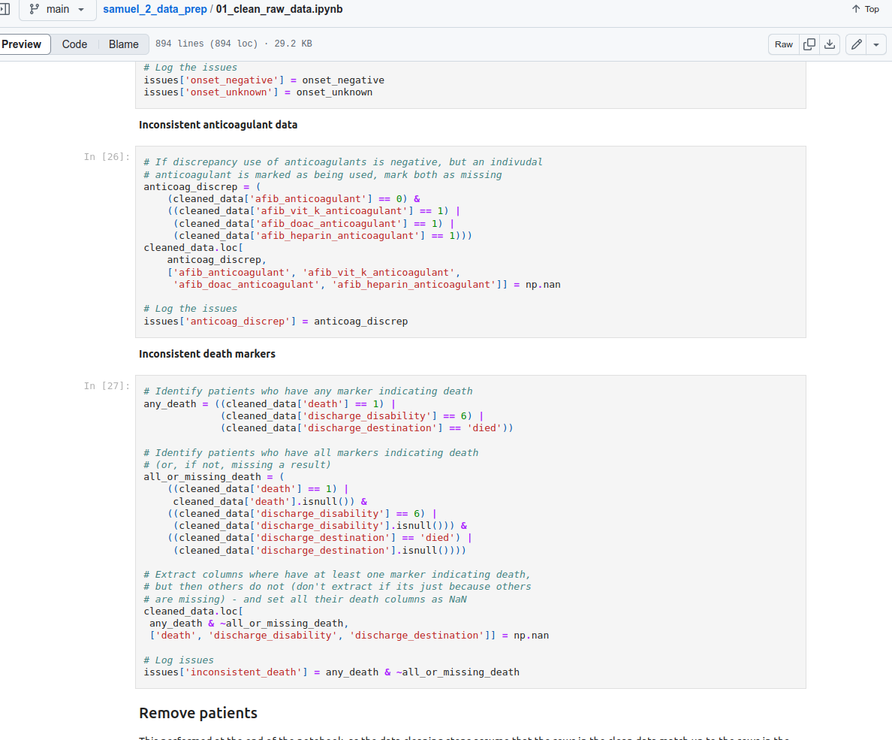
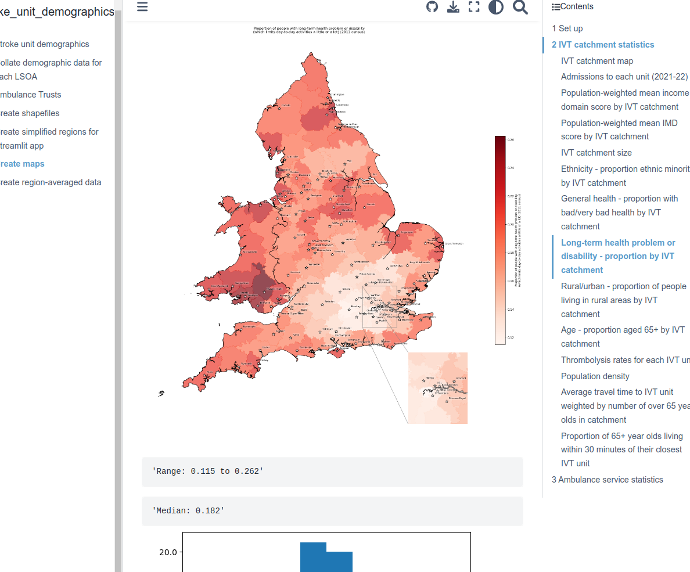

<h1 align="center">Amy Heather</h1>

  <a>I am currently a **Postdoctoral Research Associate** at the **University of Exeter**. I'm based in the Peninsula Collaboration for Health Operational Research and Data Science ([PenCHORD](https://penchord.github.io/web/intro.html)).</a>
   
   
  <a href="orcid"></a>
  <a href="linkedin"></a>
  <a href="dimensions"></a>
  <a href="scopus"></a>
  <a href="email"></a>
  <a href="exeter_profile"></a>
  <a href="osf">[-Amy_Heather-27b8ef)](https://osf.io/wmxtc/)</a>
  <a href="osf"></a>
  <a href="osf"></a>
  

  

---

### :hammer_and_wrench: Languages and Tools :

  &nbsp;
  &nbsp;
  &nbsp;
  &nbsp;
  &nbsp;
  &nbsp;
  &nbsp;

---

### 💼 Side projects:

[**Lintquarto**](https://github.com/lintquarto/lintquarto): package for running linters, static type checkers and code analysis tools on python code in quarto (`.qmd`) files.

[**Healthcare Services Analytics & Decision Science Atlas**](https://github.com/hsma-programme/decision_intelligence_atlas): a directory of open-source tools, packages, and projects for analytics and decision science in healthcare.

---

### 🌱 Research projects I'm currently working on ...

**STARS** - Sharing Tools and Artefacts for Reusable Simulations in Healthcare - [GitHub organisation](https://github.com/pythonhealthdatascience)

I am working on the STARS project from **May 2024 to April 2026**. This has involved:

* Developing template discrete-event simulation repositories in [Python (SimPy)](https://github.com/pythonhealthdatascience/rap_template_python_des) and [R (simmer)](https://github.com/pythonhealthdatascience/rap_template_r_des) which form a reproducible analytical pipeline (RAP) and follow best practice for sharing reproducible models.

  
  

* [Computational reproducibility assessments](https://pythonhealthdatascience.github.io/stars_wp1_summary/) of eight published discrete-event simulation studies in health. For each study, I attempted reproduce any results tables, figures and in-text results. I also evaluated the repository and article against various guidelines and criteria. For each assessment, the results are shared as a quarto site, with the repository structured as a "researched compendium", and test-run by a second team member. Associated pre-print: [10.48550/arXiv.2501.13137](https://doi.org/10.48550/arXiv.2501.13137).

  

* Contributing to the [Health Service Modelling Associates (HSMA) Discrete-Event Simulation Book](https://github.com/hsma-programme/hsma6_des_book/).

  

* [Modifications to the "Exeter Oncology Model: Renal Cell Carcinoma edition (EOM-RCC)"](https://github.com/pythonhealthdatascience/stars-eom-rcc). This is a model associated with technology appraisals from the National Institute of Health and Care Excellence (NICE), which was developed by the Peninsula Technology Assessment Group (PenTAG). I worked on this model to improve its open science credentials, developing a [clear README](https://github.com/pythonhealthdatascience/stars-eom-rcc), [website hosting detailed documentation](https://pythonhealthdatascience.github.io/stars-eom-rcc/), and a [pilot web application for exploring treatment sequences](https://amyheather.shinyapps.io/shinyapp/).

  
  

  

---

### 🔭 I’ve previously worked on ...

<b>Kailo - Delivering #BeeWell (a school-based wellbeing survey) with schools in Northern Devon</b>

 

I worked on Kailo from **October 2022 to April 2024**. My role was related to set-up and delivery of the #BeeWell survey, and the creation of dashboards to share results with schools and other stakeholders. #BeeWell was a school-based wellbeing survey being completed by secondary school pupils in Northern Devon in the academic year 2023-24. There were two versions of the survey - a standard survey being delivered at seven mainstream schools, and a symbol version being delivered at two non-mainstream schools. [This video](https://youtu.be/vt5fpE0bzSY) below provides a helpful introduction to the survey. It was designed to introduce young people to the survey. You can find out more about the survey at <https://kailo.community/beewell/>.

We planned to share results from the survey will be shared using dashboards (with dashboards for school-level and area-level dashboards). These are publically available with synthetic data. These have been produced using Streamlit.

* GitHub repository: [https://github.com/kailo-beewell](https://github.com/kailo-beewell)
* Package used to produce dashboards: [kailo-beewell-dashboard](https://github.com/kailo-beewell/kailo_beewell_dashboard_package).
* Streamlit dashboards:
    * Standard survey school dashboard - 
    * Symbol survey school dashboard - 
    * Area-level dashboard - 

I published a pre-registration on the Open Science Framework ([10.17605/OSF.IO/85BVN](https://doi.org/10.17605/OSF.IO/85BVN)) describing the the analysis plans for the dashboards, with two components describing each of the standard and symbol surveys.

My time on this project ended during the survey collection window. At this point, several schools had begun successfully completing the survey, and I had developed three synthetic dashboards which were very nearly complete. Before leaving, I spent a few months explaining the survey and dashboards to two colleagues at Dartington Service Design Lab, who took over the survey delivery and analysis from the point when I left the project. As such, I am no longer responsible for maintenance of these dashboards.

Exemplar screenshots from dashboards:

  
   

  
   

<b>Birth outcomes - pilot work</b>

 

From **October 2023 to April 2024** I carried out some pilot work on birth outcome prediction, using cardiotocography (CTG) data and causal inference methods. See: [GitHub organisation](https://github.com/birth-outcomes).

<b>IPACS - Improving Patient flow between Acute, Community and Social care</b>

 

In **Spring 2023**, I contributed to the discrete-time model on IPACS.

* **Model code:** I worked through the code for the model, rewriting and simplifying to improve clarity, adding comments and docstrings, and identifying and fixing bugs (as detailed [here](https://github.com/AliHarp/IPACS_MODEL)). This contributed to the [final repository hosted with NHS BNSSG Analytics](https://github.com/nhs-bnssg-analytics/ipacs-model).
* **Package and website:** I also created an example of converting part of the model (the visit-based simulation) into an R package, [as in this repository](https://github.com/amyheather/ipacs). This is supported by a [website](https://amyheather.github.io/ipacs/) that provides an overview of how to run the model, and information about the model functions.

  
  

<b>SAMueL2 - Stroke Audit Machine Learning</b>

 

In **Spring 2023**, I spent a little bit of time on some tasks for the SAMueL2 project. These were:

* Data cleaning and descriptive analysis of SSNAP data ([repository](https://github.com/samuel-book/samuel_2_data_prep))
* Demographics of emergency stroke unit catchment areas ([repository](https://github.com/samuel-book/stroke_unit_demographics), [website](https://samuel-book.github.io/stroke_unit_demographics/03_create_maps.html))

  
  

<b>Health economics - multiple sclerosis (MS)</b>

 

In Spring and Summer 2022, I worked with the University of Exeter Health Economics group.

Publications:

* A Heather; E Goodwin; C Green; N Morrish; OC Ukoumunne; RM Middleton; A Hawton. 2023. Multiple sclerosis health-related quality of life utility values from the UK MS register. Multiple Sclerosis Journal - Experimental, Translational and Clinical. https://doi.org/10.1177/20552173231178441.

[GitHub organisation](https://github.com/exeterhems)

---

### 🌸 These are a few of my favourite things...

For creating websites and applications:

* [Quarto](https://quarto.org/)
* [Streamlit](https://streamlit.io/)

For creating diagrams and images:

* [Image colour picker](https://imagecolorpicker.com/) - get the HEX code of the colour in an image
* [Draw.io](https://draw.io) - create flow-charts
* [Inkscape](https://inkscape.org/) - create diagrams as SVG
* [Colour blindness simulator](https://www.color-blindness.com/coblis-color-blindness-simulator/) - check how your image will appear for people with different colour blindness
* [Sketch.io](https://sketch.io/sketchpad/) - free-hand draw PNGs
* [uxwing](https://uxwing.com/) - icons for use freely without attribution
